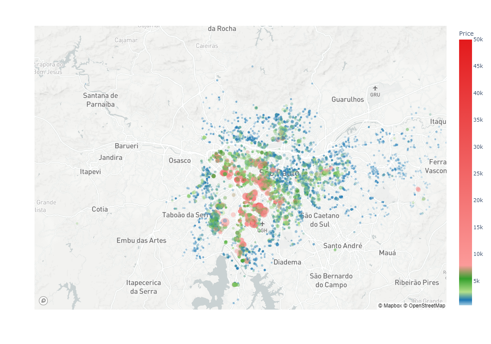

# Properties Prices Prediction 🏨

The objective of this project is to predict rent prices in São Paulo City, with data acquired in April 2019  
Three ML models were used: Linear Regression, Decision Tree, and Random Forest  
With this project, it was clear to see how ML could overfit, reaching unexpected results even with good rmse  
In the end, I tried to optimize the best model parameters and created a graph to visualize better when the prediction is better  

Click on the [Jupyter Notebook](https://github.com/marco-rocha97/properties-prices-prediction/blob/main/properties-prices-prediction.ipynb) and watch the step-by-step of this project

Dataset Link: 
[São Paulo Properties April 2019](https://www.kaggle.com/datasets/argonalyst/sao-paulo-real-estate-sale-rent-april-2019)
